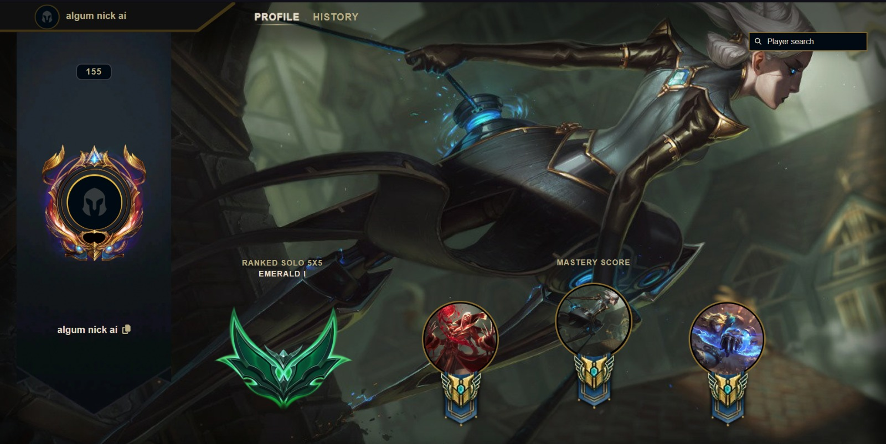
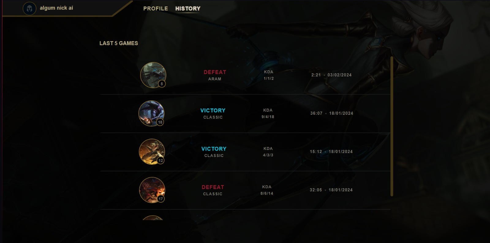
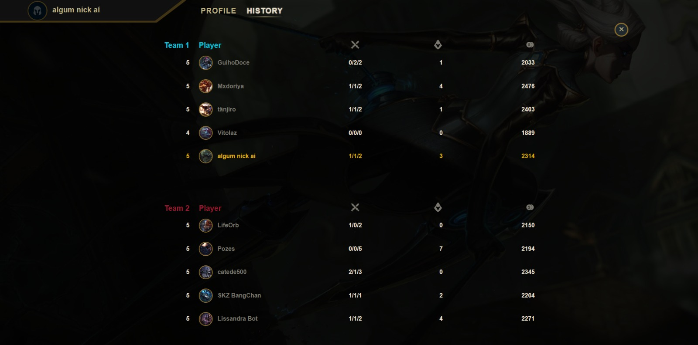

# League Profile

Este é um projeto Angular que recriou o perfil do usuário do jogo League of Legends.

## Descrição

O projeto permite que os usuários acessem tanto os próprios perfis quanto os perfis de outros jogadores.

## Capturas de Tela

### Página Inicial

*Legenda: Captura de tela da página inicial*

### Histórico de Partidas

*Legenda: Captura de tela do Histórico de Partidas*

### Detalhes das Partidas

*Legenda: Captura de tela dos Detalhes das Partidas*

## Instalação

1. Clone este repositório: `git clone https://github.com/jvittor1/League-Profile.git`.
2. Navegue até o diretório do projeto: `cd leagueProfile`.
3. Instale as dependências do FrontEnd: `npm install`.
4. Navegue até o diretório do backend: `cd riotApi`.
5. Instale as dependências do Backend: `npm install`.
6. Faça login em sua conta Riot em [developer.riotgames.com](https://developer.riotgames.com), acesse DASHBOARD e gere sua API key.
7. Acesse [developer.riotgames.com/apis#summoner-v4/GET_getBySummonerName](https://developer.riotgames.com/apis#summoner-v4/GET_getBySummonerName) e use seu nome de usuário para obter seu PuuID.
8. Defina as informações adquiridas em `enviromenment.api.ts` e em `riotApi/server.js`.

## Uso

1. Inicialize o Backend: `npm run dev`. 
2. Inicialize o Frontend: `ng serve`.
3. Abra seu navegador e vá para `http://localhost:4200/`.

## Autores

- [João Vitor](https://github.com/jvittor1)
